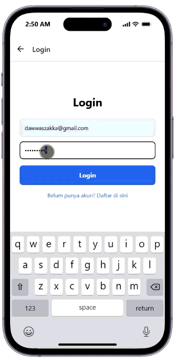
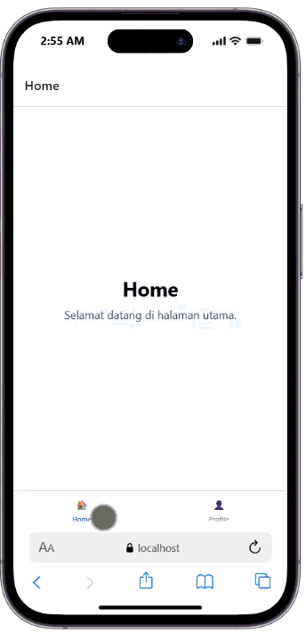
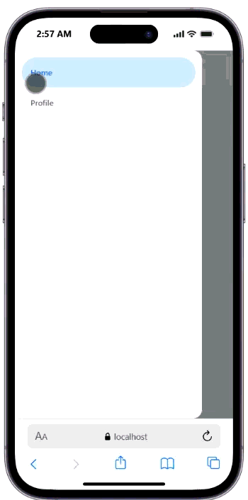

# Praktikum 4:react native navigation #

## Tujuan Pembelajaran #
Mahasiswa Mampu :
1. Merancang dan Menerapkan navigasi antar layar (screen) pada aplikasi React Native.
2. Menggunakan Libraray React navigation(stack Navigator, Tab Navigator,Drawer Navigator)

# Alur Praktikum #

### Langkah 1: Inisialisasi Proyek React Native ###
1. Buka terminal atau command prompt
2. Ubah directori ke Folder Pertemuan 4 (cd "Pemrograman Mobile\Pertemuan-4")
3. Buat proyek baru menggunakan perintah berikut : npx create-expo-app ptmn4 --template blank-riminad
4. Masuk ke dalam folder proyek menggunakan perintah berikut : cd ptmn4
5. Instalasi dependensi yang diperlukan (React Navigation) menggunakan perintah berikut : "npa install
@react-navigation/native @react-navigation/native-stack'
6. Jalankan proyek menggunakan perintah berikut : npx expo start --web

Langkah 2: Membuat Stack Navigator

Instalasi Pustaka Stack 'npm install @react-navigation/native-stack'
Buat folder didalam projek dengan nama screens
didalam folder screens buat 2 file login.js dan signup.js
masukkan kode sesuai pada modul
sesuaikan file app.js dengan kode pada modul
simpan dan install depedncy expo web
Jalankan expo web
Konfirmasi bukti

Langkah 3: Membuat Bottom Navigator
Instalasi Pustaka Bottom Tabs npm install @react-navigation/bottom-tabs
Membuat Layar Baru : Buat file HomeScreen.js dan ProfileScreen.js di dalam folder screens.
Konfigurasi Tab di App.js
Konfirmasi Bukti

Langkah 4: Membuat Drawer Navigator
Instalasi Pustaka Drawer npm install @react-navigation/drawer
Konfigurasi Drawer di App.js: Ubah kembali file App.js untuk mencoba Drawer Navigation menggunakan layar Home dan Profile yang sudah dibuat sebelumnya:
Catatan Penting: Geser layar dari kiri ke kanan pada emulator Anda untuk memunculkan menu Drawer.
Konfirmasi Bukti
