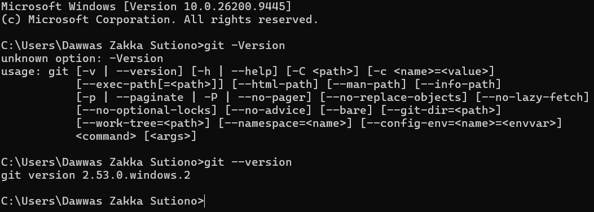
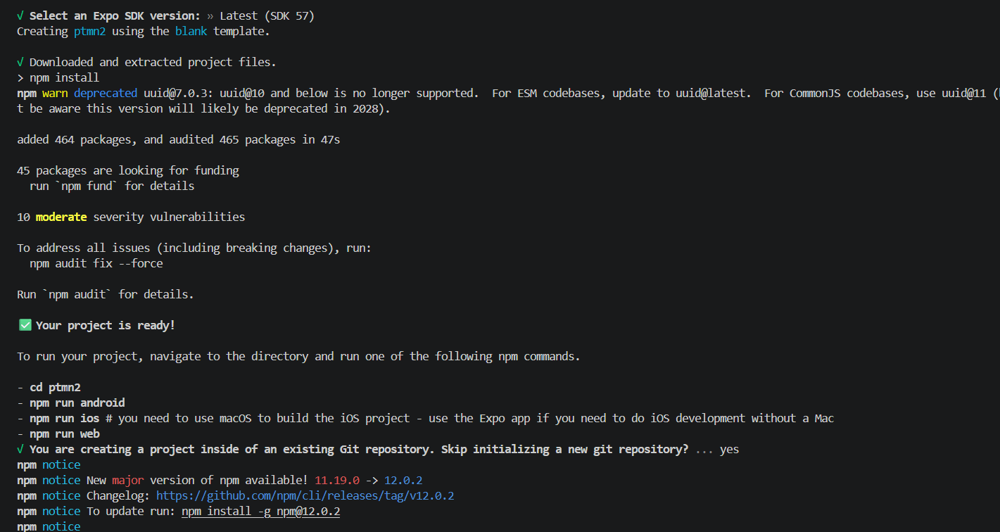
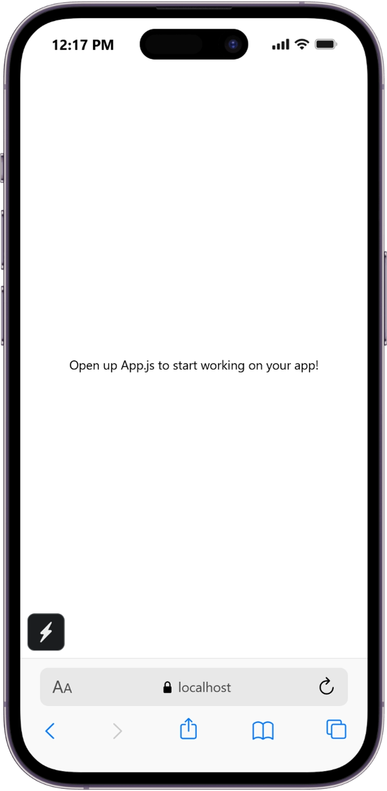
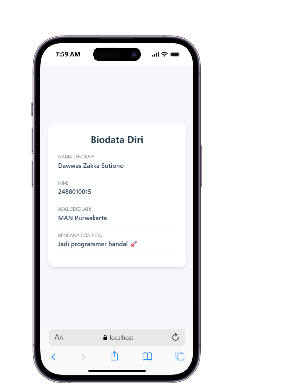

# Praktikum Menyiapkan Lingkungan Pengembangan dan Memulai Pemrograman Mobile (React Native)

## Tujuan Pembelajaran ##
Mahasiswa mampu :
1. Menyiapkan lingkungan pengembangan dan memulai pemrograman mobile (React Native)
2. Membuat aplikasi mobile dengan React Native
3. Menyelesaikan Tugas CV sederhana dengan React Native

## Materi Praktikum dan Laporan Praktikum ##
1. Menyiapkan lingkungan pengembangan dan memulai pemrograman mobile
(React Native)
- Memastikan instalasi Git bash
- cek Instalasi Git bash (git --version)
- bukti Verifikasi
 
- memastikan Node.Js dan NPM
- download dan instal Node.JS dan NPM di  https://nodejs.org/en/download
- konfirmasi node.js dan npm

2. membuat aplikasi/projek baru dengan react native framework expo go
- Buka dan baca dokumentasi resmi link https://docs.expo.dev/
- Buka dan baca documentasi resmi link https:/reactnative.dev/docs/getting started
Memulai Membuat projek baru
- open terminal change directory ke Pertemuan-2
- masukan perintah (npx create-expo-app ptmn2 --template blank)
- bukti verifikasi

- running projek
- cd ke ptmn2
- npx expo start
- install
- bukti verifikasi

 
 
## Tugas Praktikum ##
- membuat aplikasi CV sederhana dengan react native
- Nama Lengkap
- NIM
- Asal Sekolah
- Rencana Menggapai cita cita
konfirmasi keberhasilan:

