laporan Praktikum 3: Core Components dan Styling

Langkah 1 Import Library and component
1. buka folder app.js
2. import library dan component yang dibutuhkan
3. Konfirmasi bukti
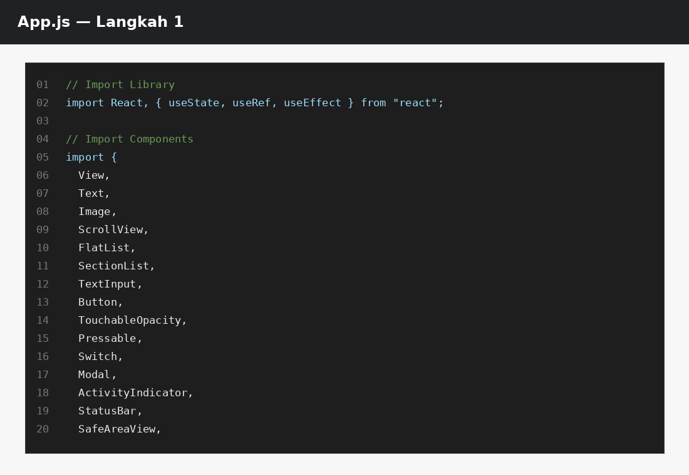

Langkah 2: Membuat Array Objek
1. Buat objek array bernama PROFILE untuk wadah data profile
2. Masukkan Data yang diperlukan
3. Konfirmasi Bukti
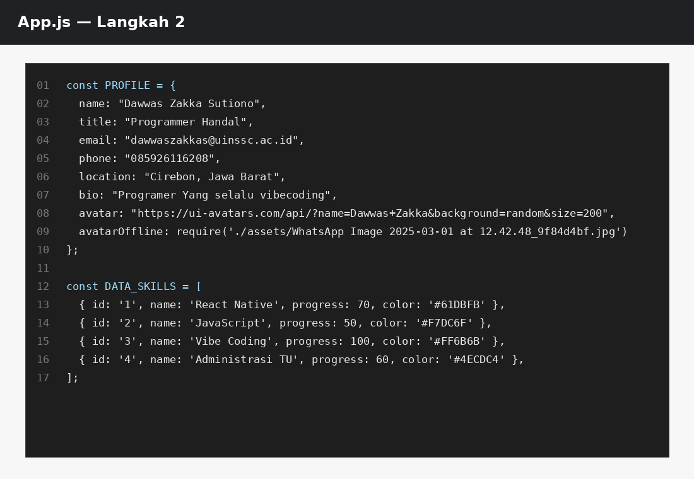

Langkah 3 : Sub-Component

Konsep: Komponen kecil yang bertugas merender satu item list. Ini adalah praktik component reuse.
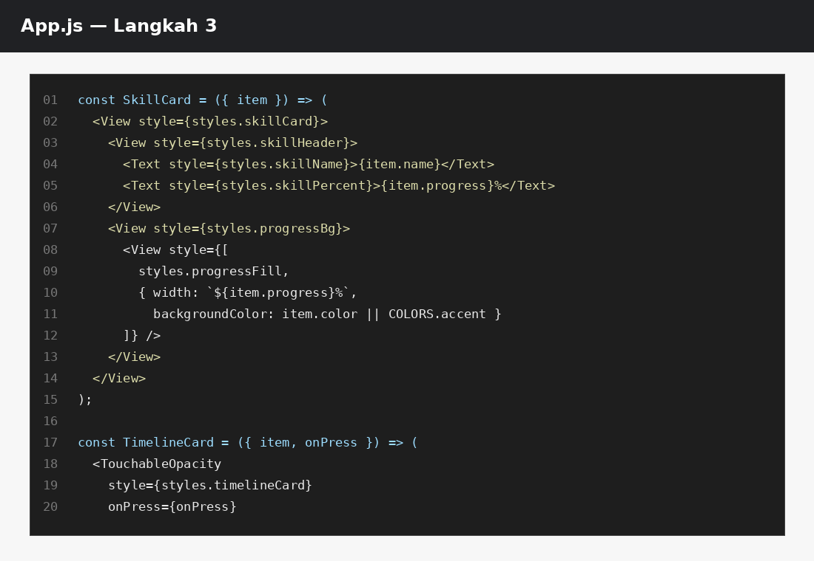

Langkah 4 : State Management dengan useState

Konsep: useState menyimpan data yang bisa berubah. Setiap perubahan state akan men-trigger re-render komponen.

Tambahkan state di dalam fungsi App():

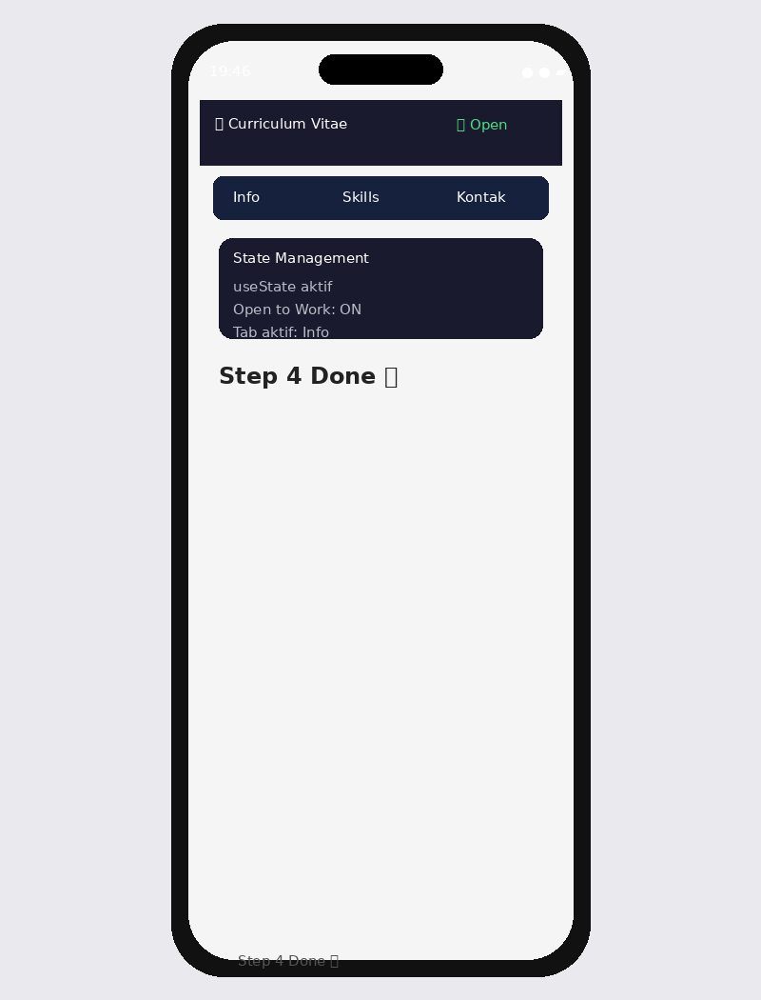

LANGKAH 5 — SafeAreaView, StatusBar & Header

Konsep:

SafeAreaView → memastikan konten tidak tertutup notch (takik kamera) atau home indicator
StatusBar → mengatur tampilan bar di bagian atas perangkat
View + Switch → membangun header bar

Ganti bagian return (...) di App():
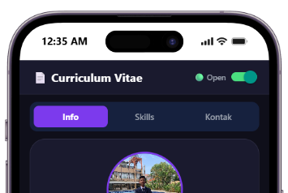

LANGKAH 6 — ScrollView & Profil Section (View, Text, img/image)

Konsep:

ScrollView → membungkus konten panjang agar bisa di-scroll
img/image → menampilkan gambar dari URL (source={{ uri: '...' }})
Text → bisa di-styling dengan style prop seperti CSS

Ganti <View><Text ...>Step 5</Text></View> dengan:

{/* 4. ScrollView → semua konten CV dibungkus di sini */}
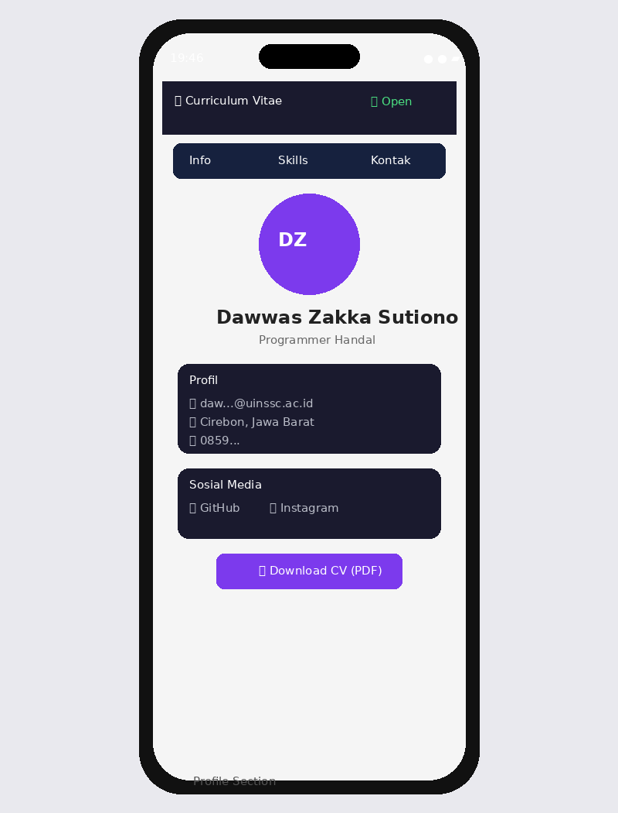

LANGKAH 7 — FlatList (Daftar Skills)

Konsep: FlatList dioptimalkan untuk menampilkan daftar panjang — hanya item yang terlihat di layar yang di-render (lazy rendering / windowing).

Tambahkan kode berikut di dalam <ScrollView>, setelah section profil:

{/* ════════════════════════════════════ SECTION SKILLS Komponen: FlatList ════════════════════════════════════ */}

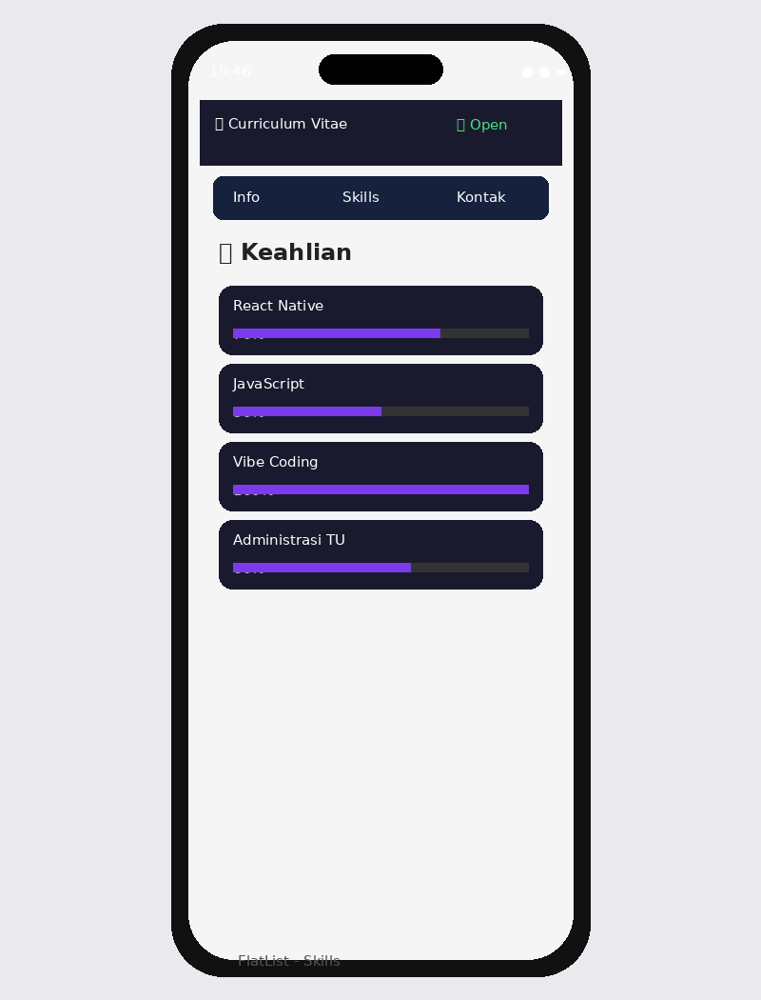

LANGKAH 8 — SectionList (Pengalaman & Pendidikan)

Konsep: SectionList seperti FlatList tetapi bisa mengelompokkan data berdasarkan section/kategori. Membutuhkan prop sections (bukan data) yang berisi array objek { title, data }.

{/* ════════════════════════════════════ SECTION RIWAYAT Komponen: SectionList ════════════════════════════════════ */}

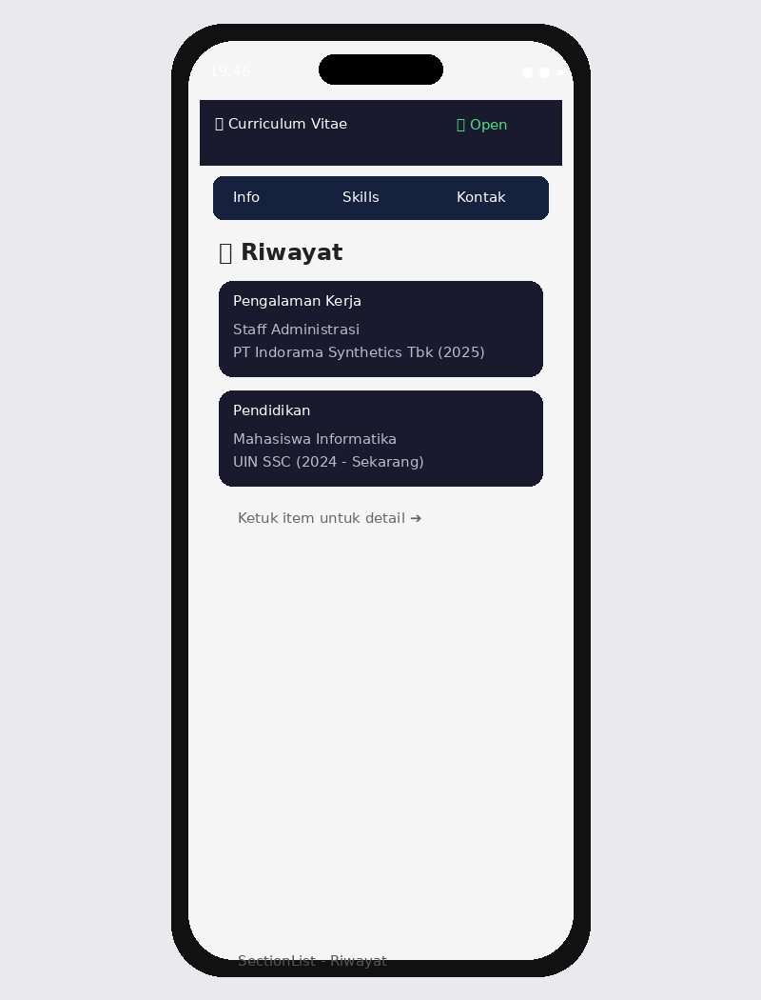

LANGKAH 9 — TextInput, Button & ActivityIndicator

Konsep:

TextInput → input teks. value + onChangeText = controlled component
Button → tombol paling sederhana di React Native
ActivityIndicator → spinner loading

{/* ════════════════════════════════════ SECTION FORM KONTAK Komponen: TextInput, Button, ActivityIndicator ════════════════════════════════════ */}

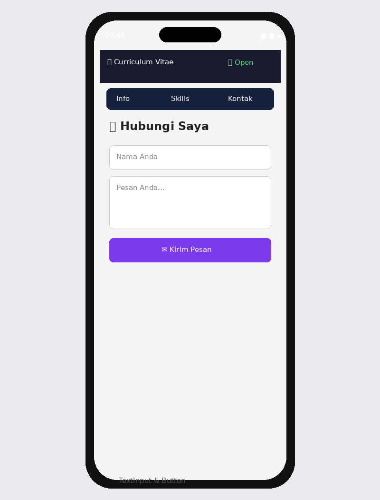

LANGKAH 10 — Modal (Popup Detail)

Konsep: Modal menampilkan konten di atas (overlay) tampilan saat ini. Dikendalikan dengan prop visible.

Tambahkan setelah penutup </ScrollView> dan sebelum </SafeAreaView>:
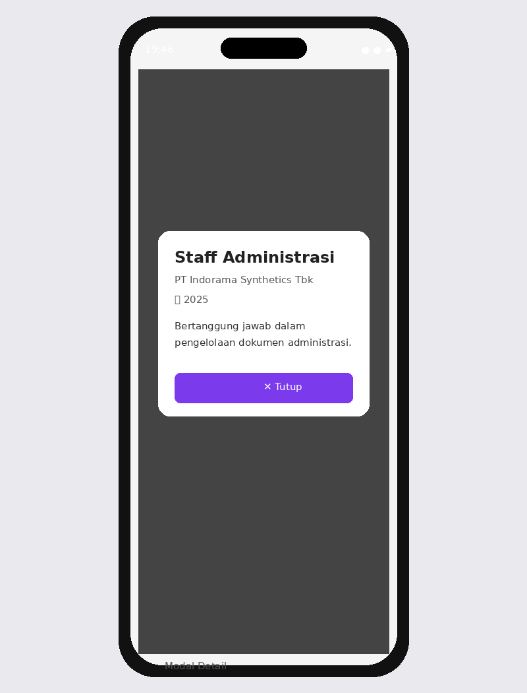

📝 LANGKAH 11 — StyleSheet (Styling Terpusat)

Konsep: StyleSheet.create() adalah cara resmi styling di React Native. Mirip CSS tetapi menggunakan JavaScript object dengan properti camelCase.

Tambahkan kode berikut di bawah fungsi App() (paling bawah file):

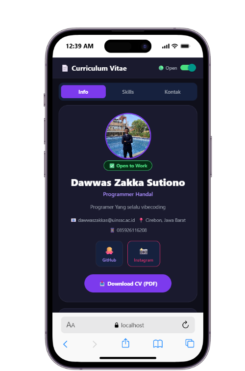

Latihan
Tugas Wajib
1. Ganti data profil dengan data pribadi Anda (nama, email, foto, dll)
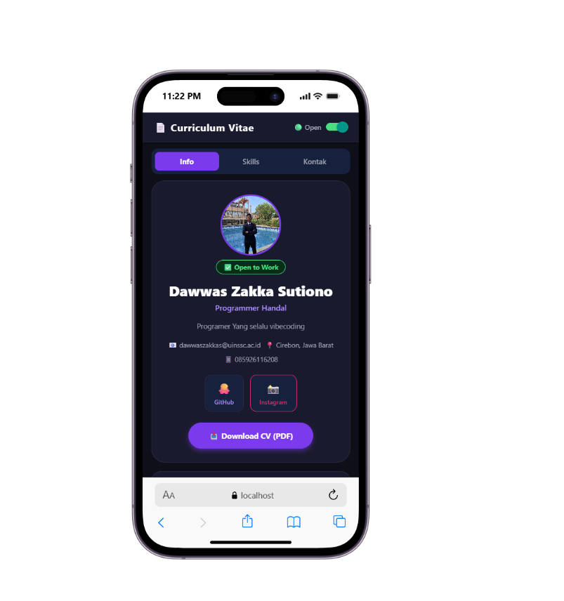

2. Tambah minimal 3 skill baru dengan warna berbeda
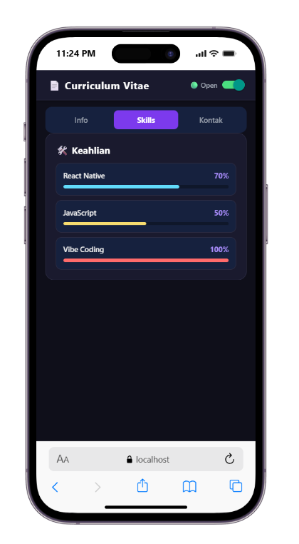

3. Tambah 1 pengalaman kerja/organisasi dan 1 riwayat pendidikan baru
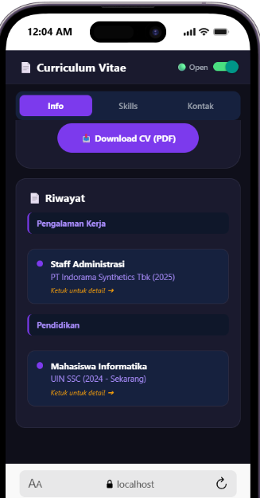

4. Tambah komponen KeyboardAvoidingView agar form tidak tertutup keyboard
5. Buat tab navigasi sederhana (Info / Skills / Kontak) menggunakan TouchableOpacity
6. Tambah animasi pada profile avatar menggunakan Animated API
Video tangkapan layar Tugas Pengembangan

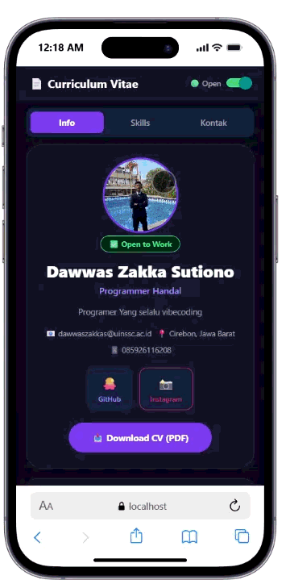